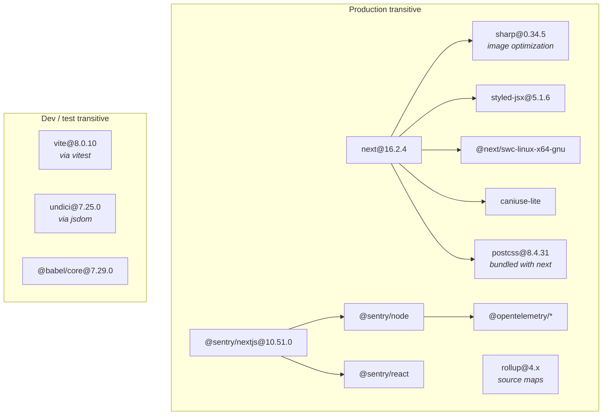
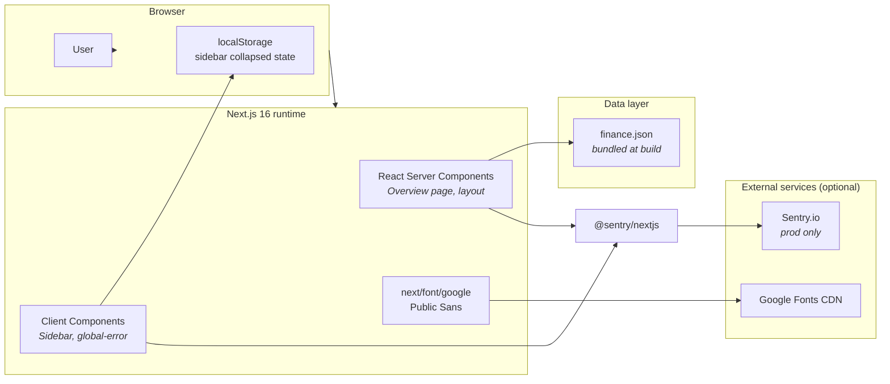
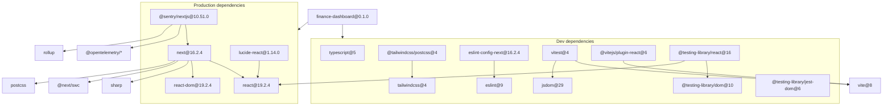

# Finance Dashboard — Dependency Map

> **Jira:** [JOSH-28](https://3p-agents.atlassian.net/browse/JOSH-28)  
> **Generated:** 2026-07-10  
> **Scope:** npm packages (direct + notable transitive), internal modules, and key runtime relationships.

---

## Executive summary

The finance-dashboard is a **self-contained Next.js 16 App Router** application with **no external database or API**. All finance data is served from a static JSON file (`data/finance.json`). The dependency surface is intentionally small: **5 production** and **14 development** direct npm packages. The critical runtime path is:

**Browser → Next.js (React 19) → static JSON + client-side UI state**

Observability is optional via **Sentry** (disabled in local dev unless explicitly enabled). Styling uses **Tailwind CSS v4** via PostCSS.

---

## 1. Direct npm dependencies

### Production (`dependencies`)

| Package | Pinned / range | Role |
|---------|----------------|------|
| `next` | `16.2.4` | App framework, routing, SSR/RSC, font loading, build toolchain |
| `react` | `19.2.4` | UI runtime |
| `react-dom` | `19.2.4` | DOM renderer |
| `@sentry/nextjs` | `^10.51.0` | Error monitoring, performance traces (prod / opt-in dev) |
| `lucide-react` | `^1.14.0` | Sidebar navigation icons |

### Development (`devDependencies`)

| Package | Pinned / range | Role |
|---------|----------------|------|
| `typescript` | `^5` | Type checking |
| `tailwindcss` | `^4` | Utility-first CSS |
| `@tailwindcss/postcss` | `^4` | PostCSS plugin for Tailwind v4 |
| `eslint` + `eslint-config-next` | `^9` / `16.2.4` | Linting |
| `vitest` | `^4.1.5` | Unit/component tests |
| `@vitejs/plugin-react` | `^6.0.1` | React support for Vitest |
| `jsdom` | `^29.1.1` | DOM environment for tests |
| `@testing-library/*` | various | Component testing utilities |
| `@types/*` | various | TypeScript type definitions |

---

## 2. Notable transitive dependencies

These are not declared directly but materially affect build, runtime, or security posture.



| Transitive package | Pulled in by | Why it matters |
|--------------------|--------------|----------------|
| `sharp` | `next` | Image optimization at build/runtime; native binary dependency |
| `styled-jsx` | `next` | Scoped CSS for Next.js internals |
| `@next/swc-*` | `next` | Rust-based compiler/transpiler — core build path |
| `@opentelemetry/*` | `@sentry/nextjs` | Distributed tracing instrumentation |
| `rollup` | `@sentry/nextjs` | Source map upload during production builds |
| `vite` | `vitest` | Test runner bundler (dev only) |
| `undici` | `jsdom` | HTTP client in test DOM (dev only) |
| `@babel/core` | `@testing-library/dom`, `@vitejs/plugin-react` | Transpilation in dev/test |

**Total installed packages:** 608 (as of `npm install` on 2026-07-10).

---

## 3. Internal module dependency map

```mermaid
flowchart TB
  subgraph data["Static data"]
  json["data/finance.json"]
  end

  subgraph lib["lib/"]
  types["types.ts"]
  data_lib["data.ts"]
  format["format.ts"]
  theme["theme.ts"]
  sentry_noop["sentry/noop.ts"]
  end

  subgraph shell["components/shell/"]
  AppShell["AppShell.tsx"]
  Sidebar["Sidebar.tsx<br/><i>client</i>"]
  Placeholder["PlaceholderPage.tsx"]
  end

  subgraph ui["components/ui/"]
  Card["Card.tsx"]
  DonutChart["DonutChart.tsx"]
  end

  subgraph overview["components/overview/"]
  BalanceCards["BalanceCards.tsx"]
  BudgetsCard["BudgetsCard.tsx"]
  PotsSummary["PotsSummary.tsx"]
  RecurringBillsCard["RecurringBillsCard.tsx"]
  TransactionsPreview["TransactionsPreview.tsx"]
  end

  subgraph app["app/ (Next.js routes)"]
  layout["layout.tsx"]
  page["page.tsx<br/>/ Overview"]
  tx["transactions/page.tsx"]
  budgets["budgets/page.tsx"]
  pots["pots/page.tsx"]
  bills["recurring-bills/page.tsx"]
  global_err["global-error.tsx"]
  end

  subgraph infra["Infrastructure"]
  next_cfg["next.config.ts"]
  instr["instrumentation.ts"]
  instr_client["instrumentation-client.ts"]
  sentry_srv["sentry.server.config.ts"]
  sentry_edge["sentry.edge.config.ts"]
  end

  json --> data_lib
  types --> data_lib
  types --> overview
  types --> ui

  data_lib --> page
  data_lib --> RecurringBillsCard
  format --> overview
  theme --> overview
  theme --> ui

  AppShell --> Sidebar
  layout --> AppShell
  layout --> globals["globals.css"]

  page --> BalanceCards
  page --> BudgetsCard
  page --> PotsSummary
  page --> RecurringBillsCard
  page --> TransactionsPreview

  BudgetsCard --> Card
  BudgetsCard --> DonutChart
  PotsSummary --> Card
  RecurringBillsCard --> Card

  tx --> Placeholder
  budgets --> Placeholder
  pots --> Placeholder
  bills --> Placeholder

  Sidebar --> lucide["lucide-react"]
  Sidebar --> next_link["next/link"]
  Sidebar --> next_nav["next/navigation"]

  next_cfg --> sentry_noop
  next_cfg --> sentry_pkg["@sentry/nextjs"]
  instr --> sentry_pkg
  instr_client --> sentry_pkg
  sentry_srv --> sentry_pkg
  sentry_edge --> sentry_pkg
  global_err --> sentry_pkg
```



### Module layers

| Layer | Modules | Notes |
|-------|---------|-------|
| **Data** | `data/finance.json`, `lib/data.ts`, `lib/types.ts` | Single source of truth; no API layer |
| **Utilities** | `lib/format.ts`, `lib/theme.ts` | Pure functions, no side effects |
| **UI primitives** | `components/ui/*` | Reusable Card, DonutChart |
| **Feature** | `components/overview/*` | Overview dashboard widgets |
| **Shell** | `components/shell/*` | Layout, sidebar, placeholder pages |
| **Routes** | `app/**` | Next.js App Router pages |
| **Observability** | `instrumentation*.ts`, `sentry.*.config.ts`, `lib/sentry/noop.ts` | Sentry gated by env vars |

---

## 4. Runtime relationships



### Request flow (Overview `/`)

1. **Server render:** `app/page.tsx` calls `getFinanceData()` which imports `data/finance.json` at build/bundle time.
2. **HTML sent to browser** with pre-rendered balance cards, pots, transactions, budgets, recurring bills.
3. **Client hydration:** `Sidebar` (client component) hydrates, reads/writes `localStorage` for collapse state.
4. **No API calls** for finance data — the app is fully static after build.

### Sentry activation gates

Sentry is enabled when **any** of:

- `NODE_ENV === "production"`
- `ENABLE_SENTRY === "true"`
- `NEXT_PUBLIC_ENABLE_SENTRY === "true"`

When disabled, `next.config.ts` aliases `@sentry/nextjs` → `lib/sentry/noop.ts` (no-op stubs).

Required env vars for full Sentry in production:

| Variable | Purpose |
|----------|---------|
| `SENTRY_DSN` | Error ingestion endpoint |
| `SENTRY_ORG` | Org slug (build-time source map upload) |
| `SENTRY_PROJECT` | Project slug |
| `SENTRY_AUTH_TOKEN` | CI/build auth for source maps |

---

## 5. Critical dependencies & risk flags

### 🔴 Critical — framework core (single points of failure)

| Dependency | Risk | Mitigation |
|------------|------|------------|
| **Next.js 16.2.4** | Entire app architecture, routing, build, and deployment depend on this single framework. Pinned to exact version. | Monitor Next.js security advisories; upgrade path is `16.2.10` (see audit). |
| **React 19.2.4** | All UI rendering. Tightly coupled to Next.js 16. | Upgrade alongside Next.js releases. |
| **data/finance.json** | **Only data source** — no database, no API fallback. Data changes require rebuild/redeploy. | Acceptable for MVP; blocks multi-user / real-time use cases. |

### 🟠 High — security advisories (as of 2026-07-10 `npm audit`)

| Package | Severity | Issue | Fix |
|---------|----------|-------|-----|
| `next@16.2.4` | **High** | Multiple CVEs: DoS (Server Components, Cache Components, Image API), middleware bypass, XSS (CSP nonces, beforeInteractive scripts), cache poisoning, SSRF (WebSocket upgrades) | Upgrade to `next@16.2.10` |
| `vite@8.0.10` | **High** | `server.fs.deny` bypass (Windows), NTLMv2 hash disclosure | `npm audit fix` (dev-only impact) |
| `undici@7.25.0` | **High** | TLS bypass, header injection, DoS (via `jsdom`, dev/test only) | `npm audit fix` |
| `postcss@8.4.31` | Moderate | XSS via unescaped `</style>` (bundled inside `next`) | Resolved by Next.js upgrade |
| `@opentelemetry/core` | Moderate | Unbounded memory allocation (via `@sentry/nextjs`) | Await Sentry SDK update |
| `@babel/core` | Low | Arbitrary file read via source map URL (dev/test) | `npm audit fix` |

**Total:** 13 vulnerabilities (1 low, 9 moderate, 3 high).

### 🟡 Medium — maintenance & version drift

| Package | Current | Latest | Notes |
|---------|---------|--------|-------|
| `next` | 16.2.4 | 16.2.10 | Security patches available; pinned exact version blocks auto-update |
| `@sentry/nextjs` | 10.51.0 | 10.65.0 | 14 minor versions behind; carries OpenTelemetry CVEs |
| `lucide-react` | 1.14.0 | 1.24.0 | 10 minor versions behind; low risk (icons only) |
| `tailwindcss` | 4.2.4 | 4.3.2 | Minor update available |
| `eslint` | 9.39.4 | 10.6.0 | Major version available; `eslint-config-next` may lag |
| `typescript` | 5.9.3 | 7.0.2 | Major version jump; not urgent |

### 🟢 Low risk / well-maintained

| Package | Assessment |
|---------|------------|
| `react` / `react-dom` | Actively maintained by Meta; current stable |
| `vitest` / `@testing-library/*` | Dev-only; active ecosystem |
| `sharp` | Industry standard for Node image processing; native binary per platform |
| `lucide-react` | Icon library; no runtime security surface |

### ⚪ Architectural notes (not npm risks)

| Item | Assessment |
|------|------------|
| **No authentication** | No auth library; all data is public static JSON |
| **No database** | No ORM, no connection strings, no data persistence layer |
| **No external API** | Zero network dependency for core functionality |
| **Google Fonts** | Runtime CDN fetch for Public Sans; offline builds still work with fallback |
| **localStorage** | Sidebar state only; non-critical, client-only preference |

---

## 6. Dependency graph (full direct + notable transitive)



---

## 7. Recommendations

1. **Upgrade `next` to `16.2.10`** — addresses 12+ high-severity CVEs in the current pin. Update `eslint-config-next` to match.
2. **Upgrade `@sentry/nextjs` to `10.65.0`** — pulls in patched OpenTelemetry transitive deps.
3. **Run `npm audit fix`** for dev-only issues (`vite`, `undici`, `@babel/core`).
4. **Document the static-data SPOF** — if real finance data is planned, introduce an API layer before adding auth.
5. **Pin vs. range policy** — `next`, `react`, `react-dom` are exact-pinned; `@sentry/nextjs` and `lucide-react` use caret ranges. Consider consistent pinning for reproducible builds.

---

## Appendix: commands used

```bash
npm ls --depth=1          # direct dependency tree
npm ls --all --depth=2    # deeper transitive view
npm audit                 # security vulnerability scan
npm outdated              # version drift check
```
